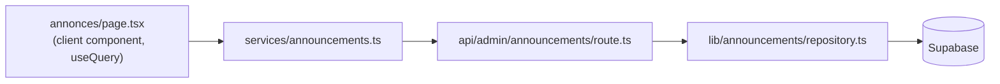
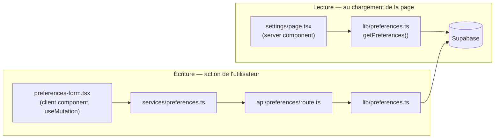

# Architecture — flux de données

Une page qui affiche ou modifie des données de la db (produit, user, préférences...) suit un chemin différent selon que la **lecture** est déclenchée depuis un composant serveur ou un composant client. L'**écriture**, elle, suit toujours le même chemin.

## Vue d'ensemble

| Opération | Déclenché depuis | Chemin | Pourquoi |
|---|---|---|---|
| Lecture (composant client) | page en `'use client'`, avec `useQuery` | `page.tsx` → `services/*.ts` → `/api/**/route.ts` → `lib/*/repository.ts` → Supabase | Un composant client ne peut pas importer de code `server-only` ni parler à Supabase directement — il doit passer par une route `/api` |
| Lecture (composant serveur) | Server Component (pas de `'use client'`) | `page.tsx` / `layout.tsx` → `lib/*.ts` → Supabase | Le composant tourne déjà côté serveur : inutile de refaire un aller-retour HTTP vers sa propre API |
| Écriture (toujours) | composant client (formulaire, bouton...) | composant → `useMutation` → `services/*.ts` → `/api/**/route.ts` → `lib/*/repository.ts` → Supabase | Une action utilisateur part forcément d'un composant client, qui doit donc passer par `/api` |

## Exemple : announcements (lecture + écriture côté client)

La page liste (`src/app/[locale]/dashboard/annonces/page.tsx`) est en `'use client'` et affiche les données via `useQuery` → même chemin pour lire et pour écrire.

## Exemple : settings (lecture serveur, écriture client)

La page (`src/app/[locale]/dashboard/settings/page.tsx`) est un Server Component : elle lit directement via `lib/preferences.ts`, sans `/api` ni service. Le formulaire (`preferences-form.tsx`) et `PreferencesSync`, eux, sont des composants client : leurs écritures suivent le chemin classique.

`lib/preferences.ts` a `import 'server-only'` en tête : toute tentative de l'importer depuis un composant client fait planter le build, donc impossible de se tromper de chemin.

## Règle générale

- **Lecture pendant le rendu serveur** → appel direct à `lib/`.
- **Action déclenchée côté client** (lecture ou écriture) → passe par `/api` + `services/*`.
